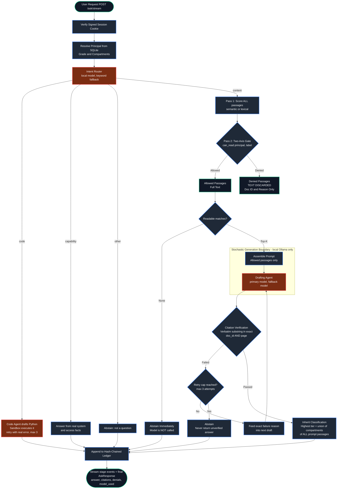
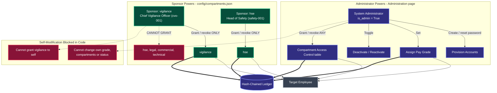

<div align="center">

# SEVERANCE

### Sovereign, Air-Gapped Document Trust Workbench for MRPL

**Smart India Hackathon 2026 — Problem Statement 26117**

*Automating Section 10 of the RTI Act 2005 ("Severability") at the passage level.*


</div>

---

## What is SEVERANCE?

Ask a question of a classified document corpus. SEVERANCE finds the answer **only inside the passages you are personally cleared to read**, quotes them verbatim, proves every quote against the source, stamps the answer with an inherited classification, and writes the whole event into a tamper-evident ledger.

Everything runs on one machine. Every language, vision, code and embedding model runs **locally through Ollama**. There is no cloud LLM fallback anywhere in the codebase — your documents and your questions never leave the box.

> **The governing principle: the model proposes, the code disposes.**
> Access decisions, the two-axis security gate, citation verification and audit entries are all made by deterministic Python — *never* by a model. If the model invents a quote, deterministic code catches it and the answer is withheld.

### At a glance

| | |
|---|---|
| **Problem it solves** | RTI Section 10 requires disclosing the severable parts of a record while withholding the exempt parts. Doing that by hand, page by page, does not scale. |
| **How it's different** | Denied text is discarded **at the retrieval boundary**, before a prompt is ever assembled. The model physically cannot leak what it was never shown. |
| **Sovereignty** | 100% local inference. In Docker, the app, the model server and the sandbox sit on a network with no route to the internet — enforced by the container runtime, not by app policy. |
| **Trust** | Every quoted citation must appear verbatim in the exact document *and* page, or the answer is withheld. Every event is appended to a SHA-256 hash-chained ledger. |
| **Stack** | Python 3.11+ · FastAPI · SQLite · React + Vite + Tailwind · Ollama |

---

## Table of Contents

1. [Quick Start](#1-quick-start)
2. [Your First 5 Minutes — the guided demo](#2-your-first-5-minutes--the-guided-demo)
3. [What the Workbench Does](#3-what-the-workbench-does)
4. [How It Works — the request path](#4-how-it-works--the-request-path)
5. [The Two-Axis Access Control Model](#5-the-two-axis-access-control-model)
6. [The Permission Model — who can grant what](#6-the-permission-model--who-can-grant-what)
7. [The Local Models](#7-the-local-models)
8. [The Web UI](#8-the-web-ui)
9. [Configuration Reference](#9-configuration-reference)
10. [Project Structure](#10-project-structure)
11. [API at a Glance](#11-api-at-a-glance)
12. [Testing](#12-testing)
13. [Adding Your Own Documents](#13-adding-your-own-documents)
14. [Troubleshooting](#14-troubleshooting)
15. [FAQ](#15-faq)
16. [Glossary](#16-glossary)
17. [Honest Engineering Boundaries](#17-honest-engineering-boundaries)

---

## PS-26117 Requirement Traceability

Every requirement from the MRPL problem statement, where it lives, and how to show it.

| Requirement | Implementation | How to demonstrate |
|---|---|---|
| Self-hosted, air-gapped, nothing leaves the premises | All inference via local Ollama (`agents/real.py`); ADK backend refuses non-Ollama models (`agents/adk.py`); UI loads no web fonts/CDNs | Sovereignty page → live monitor shows only `127.0.0.1:11434` traffic |
| **Visible proof of no external calls** | `trust/egress.py`: in-process guard blocks any non-private `connect()`, plus an OS socket-table monitor over the API + Ollama processes; `ops/network_monitor.py` (standalone); Docker `internal: true` network | Sovereignty page (polls every 2s) → *Attempt external connection* button shows **BLOCKED**; the ledger records `EGRESS_GUARD_PROBE` |
| Multiple open-weight models, **auto-selected per task** | `config/models.json` registry + `agents/registry.py` (best *installed* model per task); intent router in `classify_intent` | Models page → *Automatic Model Selection* table. Ask a coding question (→ qwen2.5-coder) and a document question (→ granite/gemma), and watch the model badge in Live Agent Activity |
| New models addable without redesign | `ollama pull <id>` + one JSON entry in `config/models.json` | `tests/test_sovereign_features.py::test_new_model_is_selected_by_adding_a_registry_entry` |
| **Agent: plans multi-step work, calls local tools, iterates** | `harness/agent_loop.py` (plan → tool call → observation → next step, bounded); tools in `harness/agent_tools.py`: `search_documents`, `read_file`, `write_file`, `read_spreadsheet`, `write_spreadsheet`, `run_python` (sandbox), `analyze_image`, `create_word_document`, `create_presentation`, `list_files` | Toggle **Agent** in the query box, or ask for a file deliverable. The Results panel shows the plan and every executed tool call with its real output |
| Code execution in a sandbox, verified | `harness/code_runner.py` + `agents/sandbox.py` (subprocess locally; network-less, read-only container in Docker) | "Write a python script to compute compound interest on 50000 at 8% for 5 years": the code is run, and a failure is fed back and retried |
| Spreadsheet work | xlsx/csv uploads (`ingest/ephemeral.py`), sandbox `read_rows`/`write_rows` helpers, `write_spreadsheet(from_csv=...)`; typed numbers must appear in a tool result (`_ungrounded_numbers`) | Attach `demo/unit_inventory.xlsx`: "Which items are below their reorder level? Save them to reorder_list.xlsx with the shortfall quantity." |
| Scanned PDFs, handwriting, drawings, photos (on-device OCR + vision) | `ingest/ocr.py` (local Tesseract) feeds the citation-verified text channel; the page image also goes to the local vision model (unverified, labeled) | Attach `demo/scanned_inspection_report.pdf` (image-only) → *Draft Approval Note*. Attach `demo/pid_drawing.png`: "List every equipment and instrument tag … save to pid_tags.xlsx" |
| **End-to-end agentic task: scanned inspection report → approval note (Word)** | `harness/approval_note.py` + `deliver/approval_note.py` | Attach `demo/scanned_inspection_report.pdf` → **Draft Approval Note** → download the DOCX |
| Real deliverables (Word/PPT/Excel, working code, calculations with steps) | `deliver/*.py`, `deliver/agent_files.py` (classification-stamped); code prompt prints each calculation step | Download buttons on every answer; agent files under *Deliverables* |
| Grounded in the organisation's own manuals/SOPs (local knowledge base) | `corpus/` + `harness/retrieve.py` (lexical/semantic via local `nomic-embed-text`), two-axis clearance gate, verbatim citation verification | Knowledge Base / Documents pages; every answer lists verified citations |

Generate the demo inputs (synthetic, no real MRPL data) with `python scripts/make_demo_assets.py`.

> **Hardware note.** On a laptop-class machine with 3–4B models, agent tasks take ~30–90 s and small models occasionally fail a step (the loop retries, and withholds rather than fabricates). A 20B+ model on a real GPU server (`gpt-oss:20b` is already in the registry) is both faster and more reliable.

---

## 1. Quick Start

### Prerequisites

| Requirement | Why you need it | Notes |
|---|---|---|
| **Python 3.11+** | Runs the API and the trust pipeline | `python --version` |
| **[Ollama](https://ollama.com)** | Serves every local model | Must be running before you start the server |
| **~6 GB disk** | The four local models | Pulled once, reused forever |
| **Node.js 18+** | *Optional* — only to rebuild the frontend | A production build is already committed in `ui-react/dist` |

---

### Option A — Run on your machine (recommended for development)

```bash
# 1. Pull the local models (one time, ~6 GB), plus Tesseract for on-device OCR
#    (macOS: brew install tesseract   Ubuntu: apt install tesseract-ocr)
#    Any installed models listed in config/models.json are picked up automatically.
ollama pull gemma3:4b
ollama pull qwen3.5:2b-q4_K_M
ollama pull qwen2.5-coder:3b
ollama pull nomic-embed-text

# 2. Configure
cp .env.example .env          # Windows: copy .env.example .env
#    ...then edit SEVERANCE_SECRET_KEY and SEVERANCE_ADMIN_PASSWORD

# 3. Install Python dependencies
python -m venv venv
source venv/bin/activate      # Windows: venv\Scripts\activate
pip install -r requirements.txt

# 4. Verify the trust logic before you trust it
python -m pytest tests/

# 5. Start
python -m uvicorn api.main:app --host 127.0.0.1 --port 8080
```

Open **<http://localhost:8080>**.

> **Note:** uvicorn prints a `0.0.0.0` line. That is a *bind address*, not a URL. Always open `localhost`.

On first startup the SQLite database is created and the administrator account from `.env` is seeded. You will see a startup warning about missing sponsor accounts — that is expected on a fresh install, and [Step 2 of the demo](#step-2--create-the-sponsor-accounts) fixes it.

---

### Option B — Run in Docker (recommended for the sovereignty demo)

```bash
# Pull the models on the HOST first -- the containers have no internet access
ollama pull gemma3:4b && ollama pull qwen3.5:2b-q4_K_M
ollama pull qwen2.5-coder:3b && ollama pull nomic-embed-text

docker compose up -d --build
```

Open **<http://localhost:8080>**.

```text
host :8080 --> gateway --(severance_internal, no route out)--> api --> ollama
                                                                |
                                          unix socket (volume)  v
                                                              sandbox (no network at all)
```

Only `gateway` publishes a port, and it is bound to `127.0.0.1`. `api`, `ollama` and `sandbox` sit on an `internal: true` Docker network, which the container runtime gives **no default route to the internet**. A `network-monitor` sidecar shares the `api` container's network namespace and logs any outbound connection attempt to a non-private address, so the isolation is visible live rather than asserted in a diagram.

Prove the sandbox isolation for yourself — each check pushes a hostile script through the *same* function the code agent uses:

```bash
docker compose exec -T api python - < ops/prove_isolation.py
```

---

### Option C — No models installed? Run the offline mock

Set `AGENT_BACKEND=mock` in `.env`. The full trust pipeline (gating, verification, ledger, UI) runs against a deterministic canned agent with no Ollama required. Ideal for CI, for testing the access model, or for a laptop with no GPU.

---

## 2. Your First 5 Minutes — the guided demo

### Step 1 — Log in as the administrator

Use `SEVERANCE_ADMIN_ID` / `SEVERANCE_ADMIN_PASSWORD` from your `.env` (defaults: `admin-001` / `InitialAdminPassword123!`).

### Step 2 — Create the sponsor accounts

Startup warns until every sponsor declared in `config/compartments.json` exists. Open **Administration** from the top-right menu and create these five accounts (each gets a temporary password to change on first login):

| Employee ID | Name / Role | Sponsors the compartment |
|---|---|---|
| `cvo-001` | Chief Vigilance Officer | `vigilance` |
| `safety-001` | Head of Safety | `hse` |
| `legal-001` | Company Secretary | `legal` |
| `comm-001` | GM Commercial | `commercial` |
| `tech-001` | GM Technical | `technical` |

Prefer the command line?

```bash
python scripts/create_employee.py --id cvo-001 --name "Chief Vigilance Officer" \
  --job-title "Chief Vigilance Officer" --grade H --password "YourPassword123!"
```

### Step 3 — Stage the headline inversion

This is the demo that makes the two-axis model click. Create two more users in **Administration**:

| Person | Grade | Compartments to assign |
|---|---|---|
| A "General Manager" | `F` (rank 12 — senior) | `commercial` |
| An "Assistant Manager" | `A` (rank 7 — junior) | `vigilance` |

Assign compartments from the **Compartment Access Control** table on the Administration page.

### Step 4 — Ask the same question as both

Log in as each and ask something answerable only from the vigilance corpus, e.g. *"What did the Q2 2025 procurement audit find?"*

| Who asks | What happens | Why |
|---|---|---|
| **General Manager** (rank 12) | **Denied.** `Missing required compartment(s): vigilance` | Seniority is irrelevant on the compartment axis. |
| **Assistant Manager** (rank 7) | **Answered,** with verbatim citations. | Passes the rank floor *and* holds the compartment. |

**Rank does not buy compartment access.** That inversion — a junior reading what a senior cannot — is the whole point of the model.

### Step 5 — Watch the trust machinery work

- On the **Workbench**, watch the live **Scan → Extract → Consult → Draft** steps, the agent activity log (agent, model, outcome, timing) and the model currently in use.
- Open **Sovereignty** and verify the chain — the ledger recomputes every SHA-256 hash and confirms each row links to the previous one.
- Open **Documents** to see every corpus item with a per-user `readable` flag and the exact denial reason.
- Download the answer as **DOCX / PPTX / XLSX**, classification-stamped in the banner, the running header/footer, and the filename.

---

## 3. What the Workbench Does

| Capability | How it works |
|---|---|
| **Document Q&A** | Classifies the request, searches the corpus (semantic or lexical), gates every passage through the two-axis check, drafts with a local model, and verifies every citation verbatim before returning it. |
| **Code requests** | Routed to a dedicated local code model. The script is executed in a sandbox and returned **only if it actually runs**. Requests naming Java/C++/etc. get an equivalent Python script (the sandbox runs Python only). |
| **File & image analysis** | Upload a PDF, PowerPoint or image. Text pages go through the same citation-verified drafting; images are described by a local vision model and clearly labelled as *unverified observations*. |
| **Approval notes** | From an uploaded inspection report, extracts verified findings, adds visual observations, and drafts a formal approval note downloadable as Word. |
| **Reports** | Every answered query downloads as DOCX, PPTX or XLSX with three-way classification stamping. |
| **Conversation memory** | Follow-ups continue the same conversation, so *"that"* and *"it"* resolve against the last turns. History is persisted per user. |
| **Audit ledger** | Every query, grant and account change is appended to a SHA-256 hash-chained ledger, verifiable from the UI. |
| **Live transparency** | The UI streams each pipeline stage as it happens, showing which agent is running and which local model it is using. |

---

## 4. How It Works — the request path

The pipeline strictly separates deterministic code from stochastic generation. Models are only ever called with passages the caller is cleared to read, and nothing a model produces is trusted until deterministic code has checked it.



**Four properties worth noticing:**

1. **Denied text never reaches a prompt.** Gating happens between scoring and prompt assembly. Denials carry the doc ID and reason only — the text itself is discarded.
2. **No readable matches means the model is never called.** The system abstains immediately rather than letting a model guess.
3. **An unverifiable answer is not returned.** Failed verification feeds the exact reason back into the next draft, up to three attempts, then abstains.
4. **The answer inherits the strictest label** of *every* passage in the prompt — highest tier, union of all compartments.

Every stage boundary is streamed to the browser as newline-delimited JSON (`POST /ask/stream`), which is what drives the live activity log.

---

## 5. The Two-Axis Access Control Model

Access is evaluated on **two orthogonal axes**, and **both must pass independently**. High rank grants no compartment visibility.

```mermaid
flowchart LR
    classDef axis1 fill:#1e3a8a,stroke:#60a5fa,stroke-width:2px,color:#ffffff;
    classDef axis2 fill:#14532d,stroke:#4ade80,stroke-width:2px,color:#ffffff;
    classDef decision fill:#374151,stroke:#f59e0b,stroke-width:2px,color:#ffffff;
    classDef outcomePass fill:#064e3b,stroke:#10b981,stroke-width:2px,color:#ffffff;
    classDef outcomeFail fill:#7f1d1d,stroke:#f87171,stroke-width:2px,color:#ffffff;

    subgraph Axis1 [Axis 1: Hierarchical Rank - a ladder]
        direction TB
        G_I["Grade I: Director / CMD (Rank 15)"]:::axis1
        G_H["Grade H: Executive Director (Rank 14)"]:::axis1
        G_G["Grade G: Group General Manager (Rank 13)"]:::axis1
        G_F["Grade F: General Manager (Rank 12)"]:::axis1
        G_E["Grade E: Deputy General Manager (Rank 11)"]:::axis1
        G_D["Grade D: Chief Manager (Rank 10)"]:::axis1
        G_C["Grade C: Senior Manager (Rank 9)"]:::axis1
        G_B["Grade B: Manager (Rank 8)"]:::axis1
        G_A["Grade A: Executive / AM (Rank 7)"]:::axis1
        G_JM["Non-Management JM1-JM6 / TS1-TS6"]:::axis1
        G_S["Non-Management S1-S4"]:::axis1
    end

    subgraph Axis2 [Axis 2: Compartments - independent, unranked sets]
        direction TB
        C_HSE["hse (Health, Safety, Environment)"]:::axis2
        C_VIG["vigilance (Anti-Corruption and CVC)"]:::axis2
        C_LEG["legal (Contracts and Litigation)"]:::axis2
        C_COM["commercial (Procurement and Pricing)"]:::axis2
        C_TEC["technical (Refinery Process Secrets)"]:::axis2
    end

    subgraph AccessGate [Evaluation Gate in trust/labels.py]
        direction TB
        Cond1{"Rank meets TIER_FLOOR for the tier?"}:::decision
        Cond2{"Document compartments are a subset of<br/>the user's compartments?"}:::decision
    end

    Axis1 --> Cond1
    Axis2 --> Cond2

    Cond1 -->|No| Denied[DENIED: Insufficient Rank Floor]:::outcomeFail
    Cond2 -->|No| DeniedComp[DENIED: Missing Compartment]:::outcomeFail
    Cond1 -->|Yes| BothPass{Both Conditions Met?}:::decision
    Cond2 -->|Yes| BothPass
    BothPass -->|Yes| Allowed[ALLOWED to Read]:::outcomePass

    subgraph DemoInversion [The Headline Inversion Demo]
        GM["General Manager (Grade F, Rank 12)<br/>Compartments: commercial"]
        AM["Assistant Manager (Grade A, Rank 7)<br/>Compartments: vigilance"]
        DocVig["Vigilance Investigation Report<br/>Tier: Confidential (Floor Rank 7)<br/>Compartment: vigilance"]

        GM -.->|Evaluated against DocVig| DeniedComp
        AM -.->|Evaluated against DocVig| Allowed
    end
```



### Axis 1 — rank floors per tier

| Tier | Minimum rank | Meaning in MRPL terms |
|---|---|---|
| `public` | 0 | Everyone, including external RTI disclosures |
| `internal` | 1 | Any employee (S1 / TS1 and above) |
| `confidential` | 7 | Officer Grade A and above |
| `secret` | 11 | Grade E (DGM) and above |

Grade ranks: `S1`–`S4` = 1–4 · `TS1`–`TS6` = 1–6 · `JM1`–`JM6` = 4–6 · `A`=7 `B`=8 `C`=9 `D`=10 `E`=11 `F`=12 `G`=13 `H`=14 `I`=15.

### Axis 2 — compartments

`hse` · `vigilance` · `legal` · `commercial` · `technical`

Compartments are **unranked sets**. A document's compartments must be a **subset** of yours. Holding four of five required compartments denies the document just as completely as holding none.

### Worked examples

| Reader | Document | Rank check | Compartment check | Result |
|---|---|---|---|---|
| Grade F, holds `commercial` | `confidential` + `vigilance` | Pass (12 ≥ 7) | **Fail** — `vigilance` not held | **Denied** |
| Grade A, holds `vigilance` | `confidential` + `vigilance` | Pass (7 ≥ 7) | Pass — subset | **Allowed** |
| Grade B, holds `hse`, `technical` | `secret` + `hse` | **Fail** (8 < 11) | Pass — subset | **Denied** |
| Grade S2, holds nothing | `public`, no compartments | Pass (2 ≥ 0) | Pass — subset | **Allowed** |

> The entire gate lives in `trust/labels.py`. That module is pure — no database, no network, no clock, no randomness — and **fails closed** on any malformed or missing input. Access logic exists in exactly one file and nowhere else.

---

## 6. The Permission Model — who can grant what

Nobody can modify their own grade, compartments or account status, and every change is written to the audit ledger.



| Role | Can do | Cannot do |
|---|---|---|
| **System Administrator** | Provision accounts, reset passwords, assign grades, activate/deactivate, assign any compartment set to any *other* active user (`PUT /admin/users/{id}/compartments`) | Change their own grade, compartments or status |
| **Sponsor** (declared in `config/compartments.json`) | Grant and revoke **only their own** compartment (`POST` / `DELETE /grants`), and delegate that authority | Grant any other compartment; grant to themselves |
| **Employee** | Ask questions, upload files, download reports, change their own password | Alter any clearance, their own included |

Two details that are easy to miss:

- **Sponsoring a compartment is not the same as being able to read it.** `cvo-001` can grant `vigilance` to others but still needs it granted to them (by the administrator) to read vigilance documents.
- **Every compartment save records exactly what was added and removed** in the ledger — not just the resulting state.

---

## 7. The Local Models

| Role | Default model | Used for | `.env` key |
|---|---|---|---|
| **Primary** | `gemma3:4b` | Intent routing, document answers, capability answers, approval notes | `OLLAMA_MODEL` |
| **Fallback** | `qwen3.5:2b-q4_K_M` | Tried automatically if the primary produces zero citations | `OLLAMA_FALLBACK_MODEL` |
| **Vision** | `qwen3.5:2b-q4_K_M` | Describing uploaded images and scanned pages | `OLLAMA_VISION_MODEL` |
| **Code** | `qwen2.5-coder:3b` | Writing Python for code requests | `OLLAMA_CODE_MODEL` |
| **Embeddings** | `nomic-embed-text` | Semantic retrieval | `OLLAMA_EMBED_MODEL` |

Any locally installed Ollama model can be substituted through `.env`. The **Models** page shows which configured models are actually installed and highlights the one in use right now.

Set `OLLAMA_FALLBACK_MODEL=""` to disable the fallback, or `OLLAMA_CODE_MODEL=""` to reuse the primary model for code as well.

---

## 8. The Web UI

The React UI (`ui-react/`) is served by FastAPI from its production build in `ui-react/dist`. A legacy static HTML UI in `ui/` is used only if that build is missing.

| Page | What you do there |
|---|---|
| **Workbench** | Ask questions, attach files, draft approval notes, download reports. Shows live Scan → Extract → Consult → Draft steps, the agent activity log (agent, model, outcome, timing) and the active model. |
| **Sovereignty** | Browse the audit ledger and verify the hash chain. |
| **Knowledge Base** / **Documents** | Corpus statistics and per-user readability of every document, with the exact denial reason. |
| **Models** | Configured local models, install status and the live active model. |
| **Generated Outputs** | Conversation history with rename, delete and report downloads. |
| **Administration** | Provision users, reset passwords, set grades, activate/deactivate, assign compartments (admin); grant/revoke own compartment (sponsors). |
| **Profile** | Account details, clearances and password change. |

### Frontend development (optional)

```bash
cd ui-react
npm install
npm run dev      # http://localhost:3000, proxies API calls to :8080
npm run build    # rebuilds ui-react/dist, which FastAPI serves
```

---

## 9. Configuration Reference

Copy `.env.example` to `.env`. It is loaded automatically at startup, before any module reads a setting.

### Core

| Variable | Default | What it does |
|---|---|---|
| `SEVERANCE_SECRET_KEY` | *(placeholder)* | HMAC key for signed session cookies. **Change this.** Changing it invalidates existing logins. |
| `SEVERANCE_ADMIN_ID` | `admin-001` | Administrator seeded on first startup |
| `SEVERANCE_ADMIN_PASSWORD` | *(placeholder)* | That administrator's initial password. **Change this.** |
| `SEVERANCE_BOOTSTRAP_CODE` | *(placeholder)* | Authorization code required by `scripts/create_admin.py` |
| `SEVERANCE_DB_PATH` | `severance.db` | SQLite file holding users, grants, ledger, conversations and reports |
| `SEVERANCE_PORT` | `8080` | Port printed at startup and published by the Docker gateway |

### Agent and models

| Variable | Default | What it does |
|---|---|---|
| `AGENT_BACKEND` | `ollama` | `ollama` (local), `mock` (canned offline), or `adk` (Google ADK adapter) |
| `OLLAMA_API_BASE` | `http://localhost:11434` | Ollama endpoint (`http://ollama:11434` inside Docker) |
| `OLLAMA_MODEL` | `gemma3:4b` | Primary model |
| `OLLAMA_FALLBACK_MODEL` | `qwen3.5:2b-q4_K_M` | Second local model tried when the primary returns no citations; empty disables it |
| `OLLAMA_VISION_MODEL` | `qwen3.5:2b-q4_K_M` | Image and scanned-page description |
| `OLLAMA_CODE_MODEL` | `qwen2.5-coder:3b` | Code intent only; empty reuses `OLLAMA_MODEL` |
| `OLLAMA_EMBED_MODEL` | `nomic-embed-text` | Embeddings for semantic retrieval |

### Retrieval, sandbox and memory

| Variable | Default | What it does |
|---|---|---|
| `SEVERANCE_RETRIEVAL_MODE` | `semantic` | `semantic` (embeddings) or `lexical` (no embedding model needed) |
| `SEVERANCE_ENABLE_OCR` | `false` | `true` enables OCR for scanned PDFs; requires the optional `paddleocr` package |
| `SANDBOX_TIMEOUT_SECONDS` | `8` | Wall-clock limit per generated script |
| `SANDBOX_MEMORY_MB` | `256` | Memory limit per generated script |
| `CONVERSATION_MEMORY_TURNS` | `2` | Recent Q&A turns fed back as context — never as a citation source. Keep it small; each turn is more prompt the local model re-reads on every call. |

### Docker only

| Variable | Default | What it does |
|---|---|---|
| `OLLAMA_MODELS_DIR` | host `.ollama/models` | Host directory of already-pulled models, mounted **read-only** into the `ollama` container |
| `SANDBOX_SOCKET` | *(set by compose)* | Unix socket to the sandbox container. Leave unset for a host run. |

> There is intentionally **no cloud LLM fallback** — no Groq, no NVIDIA NIM, nothing. Adding one would break the compliance premise of the project.

---

## 10. Project Structure

```
sih2/
├── contracts.py               # Shared Pydantic shapes & enums — the cross-file vocabulary
├── API.md                     # Full REST API reference
├── requirements.txt           # Python dependencies
├── .env.example               # Environment template
├── Dockerfile / docker-compose.yml
│
├── api/
│   ├── main.py                # FastAPI app, .env loading, startup checks, React SPA serving
│   └── routes/
│       ├── auth.py            # login, logout, change-password
│       ├── admin.py           # users, grades, password reset, activation, compartment assignment
│       ├── grants.py          # sponsor grant/revoke, /grants/mine
│       ├── ask.py             # /ask, /ask/stream, uploads, approval notes, report downloads
│       ├── documents.py       # corpus listing with per-user readability
│       ├── conversations.py   # persisted conversation history
│       ├── ledger.py          # audit ledger read & chain verification
│       └── models.py          # configured local models + install status
│
├── trust/                     # ── The security core ──
│   ├── labels.py              # RANK, TIER_FLOOR, can_read(), inherit_label() — pure, fails closed
│   ├── ledger.py              # SHA-256 hash-chained audit ledger
│   ├── conversations.py       # Per-user conversation store & recent-turn context
│   └── reports.py             # Full answer storage for report regeneration
│
├── harness/                   # ── The orchestration layer ──
│   ├── runner.py              # Query lifecycle: route, retrieve, draft, verify, retry, abstain
│   ├── code_runner.py         # Code request loop: draft, execute, feed back real errors
│   ├── approval_note.py       # Inspection report -> verified findings -> approval note
│   ├── retrieve.py            # Two-pass retrieval: score everything, gate, discard denied text
│   ├── semantic.py            # Embedding-based scoring via local Ollama
│   └── verify.py              # Deterministic verbatim citation verifier
│
├── agents/                    # ── The stochastic layer (never trusted) ──
│   ├── base.py                # Agent protocol (no principal/clearance in the signature)
│   ├── real.py                # Local Ollama agent: intent routing, drafting, code, vision
│   ├── sandbox.py             # Subprocess / socket code execution with timeout & limits
│   ├── mock.py                # Deterministic offline agent for tests
│   └── adk.py                 # Google ADK adapter (optional)
│
├── auth/
│   ├── users.py               # scrypt password hashing, provisioning, grades
│   ├── sponsors.py            # Sponsor grants, delegation, admin compartment assignment
│   ├── session.py             # HMAC-SHA256 signed session cookies
│   └── deps.py                # FastAPI auth dependencies
│
├── ingest/
│   ├── pdf.py                 # Page-level PDF extraction (optional OCR)
│   ├── ephemeral.py           # In-memory per-user uploads: PDF, PPTX, images
│   └── seed.py                # First-run administrator bootstrap
│
├── deliver/                   # DOCX, PPTX, XLSX reports and approval-note DOCX
├── sandbox/                   # Sandbox container image used for Docker code execution
├── config/compartments.json   # Compartment -> sponsor declaration
├── corpus/                    # manifest.json (labels) + documents/ (PDFs) + ingestion guide
├── ops/
│   ├── network_monitor.py     # Live outbound-connection monitor for demos
│   ├── prove_isolation.py     # Hostile-script sandbox escape checks
│   └── nginx.conf             # Gateway configuration
├── scripts/                   # create_admin, create_employee, grant_compartment, fixtures
├── tests/                     # pytest suite (64 tests)
├── ui-react/                  # React + Vite + Tailwind frontend (src/ and built dist/)
└── ui/                        # Legacy static HTML UI (used only if ui-react/dist is absent)
```

**Reading the codebase in dependency order:** `contracts.py` → `trust/labels.py` → `harness/retrieve.py` → `harness/verify.py` → `harness/runner.py`. Those five files contain essentially the whole security argument.

---

## 11. API at a Glance

Every endpoint except `POST /auth/login` authenticates via the `HttpOnly`, signed `severance_session` cookie. **Caller identity is derived strictly from the verified cookie and the user store** — no request field lets a caller claim a grade or compartment.

Interactive docs are live at **<http://localhost:8080/docs>**. Full request and response examples are in **[API.md](API.md)**.

| Method | Endpoint | Purpose |
|---|---|---|
| `POST` | `/auth/login` | Authenticate, set session cookie |
| `POST` | `/auth/logout` | Clear the session |
| `POST` | `/auth/change-password` | Change own password |
| `GET` | `/me` | Current caller's profile |
| `POST` | `/ask` | Ask a question (blocking) |
| `POST` | `/ask/stream` | Ask a question, streaming NDJSON stage events |
| `POST` / `DELETE` | `/ask/upload`, `/ask/upload/{id}` | Add or drop an ephemeral upload |
| `POST` | `/ask/approval-note`, `/ask/approval-note/stream` | Draft an approval note from a report |
| `GET` | `/report/{ledger_row_id}` | Download a stamped report (`?format=docx`, `pptx` or `xlsx`) |
| `GET` | `/report/{ledger_row_id}/approval-note` | Download the approval-note DOCX |
| `GET` | `/documents` | Corpus with per-user `readable` flag and denial reason |
| `GET` | `/ledger`, `/ledger/verify` | Read the ledger; verify the hash chain |
| `GET` `PATCH` `DELETE` | `/conversations`, `/conversations/{id}` | Conversation history |
| `GET` | `/models` | Configured models and install status |
| `POST` / `GET` | `/admin/users` | Provision and list accounts *(admin)* |
| `PATCH` | `/admin/users/{id}/grade` | Change a grade *(admin, never their own)* |
| `POST` | `/admin/users/{id}/reset-password`, `/deactivate`, `/reactivate` | Account lifecycle *(admin)* |
| `GET` / `PUT` | `/admin/compartments`, `/admin/users/{id}/compartments` | Assign compartment sets *(admin)* |
| `POST` / `DELETE` | `/grants` | Grant / revoke own compartment *(sponsor)* |
| `GET` | `/grants/mine` | Compartments the caller may grant |

---

## 12. Testing

```bash
python -m pytest tests/              # all 64 tests
python -m pytest tests/ -v           # verbose
python -m pytest tests/test_labels.py tests/test_verify.py   # the security core alone
```

| Test file | Covers |
|---|---|
| `test_labels.py` | The two-axis gate and classification inheritance |
| `test_verify.py` | Verbatim citation verification |
| `test_retrieve.py` | Two-pass retrieval and denied-text discarding |
| `test_runner.py` | Full query lifecycle, abstention paths, retries |
| `test_ledger.py` | Hash-chain integrity and tamper detection |
| `test_sponsors.py` | Grant rules, self-grant blocks, delegation |
| `test_auth.py`, `test_api.py` | Sessions, cookies, endpoint authorization |
| `test_sandbox.py` | Code execution limits and failure modes |
| `test_semantic.py`, `test_pdf.py`, `test_docx.py` | Retrieval, ingestion and report generation |
| `test_mock.py`, `test_real_agent.py`, `test_adk_tools.py` | Agent backends |

The suite runs against the mock agent, so it needs neither Ollama nor a GPU.

---

## 13. Adding Your Own Documents

1. Drop the PDF into `corpus/documents/`.
2. Add an entry to `corpus/manifest.json`:

```json
{
  "doc_id": "mrpl-hse-sop-101",
  "file": "mrpl-hse-sop-101.pdf",
  "title": "MRPL HSE: Refinery Emergency Response Manual",
  "source": "MRPL HSE Operational Standards",
  "label": {
    "tier": "confidential",
    "compartments": ["hse"]
  }
}
```

3. Restart the server.

`tier` is one of `public`, `internal`, `confidential` or `secret`. `compartments` is any subset of `hse`, `vigilance`, `legal`, `commercial` and `technical`; an empty list means no compartment is required.

See **[corpus/README.md](corpus/README.md)** for the full ingestion guide and the disclosure notice about which shipped documents are authentic public records and which are simulated from public OISD and CVC specifications.

---

## 14. Troubleshooting

<details>
<summary><b>The server starts but every answer is "Response withheld"</b></summary>

Citation verification is failing, which is the system working as designed rather than crashing. Common causes:

- **The model isn't installed.** Check the **Models** page — a configured model that is not installed cannot draft.
- **The source is noisy.** Scanned documents with OCR typos often cannot be quoted verbatim, so the answer is withheld rather than shown unverified.
- **The question has no readable match.** Check the **Documents** page for your account's `readable` flags.
- **The model is too small for the question.** Try a larger `OLLAMA_MODEL`.

</details>

<details>
<summary><b>"Sponsor verification check" warning on startup</b></summary>

Expected on a fresh database. The five sponsor accounts declared in `config/compartments.json` do not exist yet — create them as described in [Step 2 of the demo](#step-2--create-the-sponsor-accounts). The warning disappears on the next restart.

</details>

<details>
<summary><b>Connection refused, or the app cannot reach Ollama</b></summary>

- Confirm Ollama is running: `ollama list` should print your models.
- Host run: `OLLAMA_API_BASE` must be `http://localhost:11434`.
- Docker run: it must be `http://ollama:11434`. docker-compose sets this automatically, so do not override it in `.env`.

</details>

<details>
<summary><b>Docker: Ollama has no models</b></summary>

The containers have no internet access by design, so they cannot download anything. Pull the models **on the host** first; the `ollama` container mounts the host's model directory read-only. If your models live somewhere non-standard, set `OLLAMA_MODELS_DIR` in `.env`.

</details>

<details>
<summary><b>I cannot log in after changing .env</b></summary>

Changing `SEVERANCE_SECRET_KEY` invalidates every existing session cookie, because sessions are HMAC-signed with it. Clear your cookies and log in again.

</details>

<details>
<summary><b>A senior person is denied a document a junior can read</b></summary>

That is the two-axis model doing its job, not a bug. See [the worked examples](#worked-examples). Rank never grants compartment access. Fix it by granting the compartment (administrator, or that compartment's sponsor) — not by raising the grade.

</details>

<details>
<summary><b>Scanned PDF rejected with ScannedPdfError</b></summary>

The PDF has no text layer. Either set `SEVERANCE_ENABLE_OCR=true` and install the optional `paddleocr` package, or upload it as a file so the vision model can describe it — that output is clearly labelled as unverified.

</details>

<details>
<summary><b>The UI looks like plain HTML</b></summary>

FastAPI fell back to the legacy `ui/` because `ui-react/dist` is missing. Rebuild it: `cd ui-react && npm install && npm run build`.

</details>

<details>
<summary><b>Code requests fail in Docker</b></summary>

Execution fails closed when the sandbox container is unreachable, and that is deliberate. Check `docker compose ps` for the `sandbox` service health, and confirm the `sandbox_socket` volume is mounted in both `api` and `sandbox`.

</details>

---

## 15. FAQ

**Does anything ever leave my machine?**
No. There is no cloud LLM code path anywhere in the repository. Under Docker, the app, model server and sandbox sit on an `internal: true` network with no route out, and the `network-monitor` sidecar logs any attempt.

**Why does it refuse to answer sometimes?**
Because it could not prove the answer. A quote that does not appear verbatim in the exact document and page is treated as a fabrication, and the answer is withheld. Abstaining is a feature of a trust workbench, not a failure of it.

**Can a clever prompt make it leak a restricted document?**
Denied text is discarded before any prompt is assembled, so the model never receives it. Prompt injection cannot exfiltrate text that was never in the context window.

**Can an administrator read everything?**
No. Administrators manage accounts and clearances; they read documents using their own grade and compartments like everyone else, and they cannot modify their own clearances.

**What classification does an answer get?**
The highest tier and the union of all compartments of every passage that went into the prompt. An answer is never less restrictive than its most restrictive source.

**Does it need a GPU?**
No, though a small GPU makes answers noticeably faster. The test suite and the `mock` backend need neither GPU nor Ollama.

**Can I swap in different models?**
Yes — any locally installed Ollama model, via `.env`. The Models page shows which configured models are actually present.

**Why Python for code requests when I asked for Java?**
The sandbox executes Python only. Requests naming another language get an equivalent Python script, and the script is returned only if it actually ran.

---

## 16. Glossary

| Term | Meaning |
|---|---|
| **Severability (RTI Section 10)** | The legal duty to release the parts of a record that are not exempt, even when other parts must be withheld. SEVERANCE applies this at the passage level. |
| **Principal** | The authenticated caller, resolved from the session cookie: person ID, name, job title, grade, compartments, admin flag. |
| **Tier** | The hierarchical axis of a label: `public`, `internal`, `confidential`, `secret`. |
| **Compartment** | The orthogonal, unranked axis: `hse`, `vigilance`, `legal`, `commercial`, `technical`. |
| **Rank floor** | The minimum rank a tier requires (`TIER_FLOOR` in `trust/labels.py`). |
| **Sponsor** | The officer who owns one compartment and may grant or revoke it — never to themselves. |
| **Two-axis gate** | `can_read(principal, label)`: rank floor **and** compartment subset, both required. |
| **Abstain** | Returning no answer, with denial reasons, because nothing readable matched or nothing could be verified. |
| **Classification inheritance** | Stamping an answer with the highest tier and union of compartments of every passage in its prompt. |
| **Hash-chained ledger** | An append-only SQLite table where each row's SHA-256 covers the previous row's hash, making any edit detectable. |
| **Ephemeral upload** | A user-uploaded file held in memory for that user only, lost on server restart. |

---

## 17. Honest Engineering Boundaries

These are stated plainly rather than buried — a trust product that overstates its guarantees is not one.

1. **Docker deployment trusts the host's models.** `docker compose up -d --build` starts `ollama`, `api`, `sandbox`, `network-monitor` and an nginx `gateway`. `api`, `ollama` and `sandbox` have no route to the internet: the first two sit on an `internal: true` network, and `sandbox` has no network interface at all. Only `gateway` publishes a port, bound to `127.0.0.1:8080`. Because the internal network cannot download anything, Ollama loads models read-only from the host's model directory (override with `OLLAMA_MODELS_DIR`), so pull them on the host first.

2. **The code sandbox is container-level in Docker, process-level on a bare host.** In Docker, generated scripts go over a Unix socket to the `sandbox` container: no network interface, read-only root filesystem, non-root user, zero Linux capabilities, a 64-process limit, 512 MB memory, 1 CPU, and no access to the corpus, database or secrets. Scripts run there one at a time with per-run memory and time limits, and execution fails closed if the sandbox is unreachable. On a bare host run (`SANDBOX_SOCKET` unset), scripts fall back to a stripped-environment subprocess, which is **not** blocked from the network or host files.

3. **Small local models are imperfect.** Answers that cannot be verified verbatim are withheld rather than shown. For noisy scanned sources this means some questions correctly return "Response withheld" instead of an answer.

4. **OCR is optional.** Scanned PDFs without a text layer are rejected with `ScannedPdfError` unless `SEVERANCE_ENABLE_OCR=true` and `paddleocr` is installed. Uploaded scans can still be read by the vision model, with its output labelled unverified.

5. **Uploads are ephemeral.** Uploaded files are held in memory per user and are lost on server restart.

6. **Single-node ledger.** The audit ledger is tamper-*evident* — any modification breaks the SHA-256 chain — but it is a local SQLite table, not a distributed ledger. Session tokens are HMAC-signed with a configured secret, not hardware-backed.

7. **Real MRPL documents are not included.** The repository ships a labelled manifest and sample PDFs. Authorized administrators add real documents to `corpus/documents/` and label them in `corpus/manifest.json`. See [corpus/README.md](corpus/README.md) for the full disclosure.

---

<div align="center">

**SEVERANCE** — the model proposes, the code disposes.

Built for Smart India Hackathon 2026 · Problem Statement 26117 · Mangalore Refinery and Petrochemicals Limited

</div>
